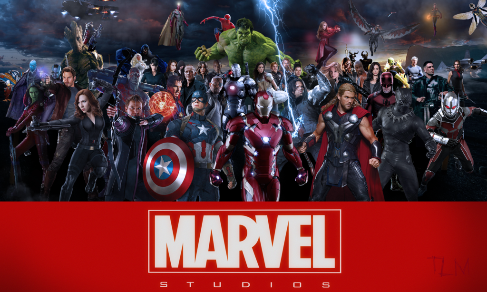

# **Marvel Fans Page** 🦸‍♂️🔥  

  

## **Overview**  
The **Marvel Fans Page** is a tribute to the **Marvel Cinematic Universe (MCU)**, featuring:  
- 🏠 **Home Page** – Displays only the **Avengers logo**, revealing images on click.  
- 🦸‍♂️ **Heroes Page** – Lists all **Avengers: Endgame** heroes with descriptions.  
- 😈 **Villains Page** – Features major **Marvel villains**.  
- 🎬 **Movies Page** – Lists **all Marvel movies** with posters.  
- 📺 **Web Series Page** – Includes only **Avengers-related web series**.  

---

## **🎨 Features & Creativity**  
✅ **Smooth Navigation** – Clickable links scroll smoothly to sections.  
✅ **Golden Glow Hover Effect** – Images glow when hovered.  
✅ **Dynamic Greetings** – Message changes based on the time of day.  
✅ **Avengers Logo Reveal** – Clicking the logo reveals images.  
✅ **Fully Responsive** – Optimized for all screen sizes.  

## **Technologies Used**  
- **HTML**: For structuring the content.  
- **CSS**: For styling and adding animations, including a golden glow effect.  
- **JavaScript**: For smooth navigation, dynamic greetings, and image interactions.

---

## **📁 Project Structure**  
Marvel-Fans-Page/
│── index.html          # Home Page (Avengers Logo)  
│── heroes.html         # List of all Avengers heroes  
│── villains.html       # Major Marvel villains  
│── movies.html         # Marvel movies with posters  
│── webseries.html      # Avengers-related web series  
│── style.css           # Combined CSS for all pages  
│── script.js           # JavaScript for interactivity  
│── images/             # Folder containing images  
│   ├── logo.jpg        # Avengers logo  
│   ├── ironman.webp    # Iron Man movie poster  
│   ├── panther.jpeg    # Black Panther poster  
│   ├── ...            # Other images  
│── README.md           # Project Documentation  